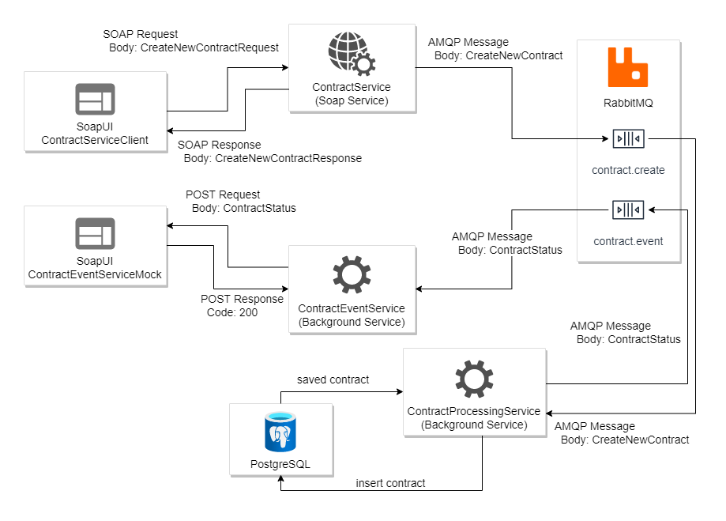

# Тестовое задание. Сервис 1/3

## Продуктовые требования

##### Реализация обработки потока данных по схеме:

#### Требуется реализовать набор микро-сервисов: **ContractService**, **ContractProcessingService** и **ContractEventService**. 

**ContractService** принимает запрос на создание договора по протоколу soap, преобразует полученный конверт 
во внутреннее представление **CreateNewContract** и пересылает сообщение в очередь **contract.create** RabbitMQ,
после чего возвращает синхронный ответ со статусом **RequestIsQueued**. Если при отправке в RabbitMQ происходит ошибка
(например, если RabbitMQ не доступен), то возвращается ответ со статусом **Error** и человеко-читаемым сообщением об
ошибке в поле ErrorMessage.

**ContractProcessingService** слушает очередь **contract.create** в RabbitMQ. Полученные из очереди сообщения записывает
в таблицу **contract** БД PostgreSQL и отправляет в очередь **contract.event** событие об успешной регистрации в виде
экземпляра **ContractStatus**. Перед сохранением выполняется проверка на дубликаты: в случае, если в БД уже записан договор
с аналогичным **contract_number** или **id** - в очередь **contract.event** отправляется событие со статусом ошибки
(для случая с **id** - свой код, для случая с contract_number - свой, описано в маппинге).
Структура таблицы contract описана в маппинге.

**ContractEventService** слушает очередь **contract.event** в RabbitMQ. Полученные из очереди сообщения транслирует 
в тело **POST**-запроса и отправляет по адресу `http:/host:port/status`.

## Маппинги

#### Маппинг **CreateNewContractRequest** во внутреннее представление **CreateNewContract**

| **CreateNewContract** | **CreateNewContractRequest** | **Описание**         | 
|         :---:         |            :---:             | :---                 |
| `id`                  | `id`                         |                      |
| `date_start`          | `DateStart`                  |                      |
| `date_end`            | `DateEnd`                    |                      |
| `date_send`           |                              | Текущие дата и время |
| `contract_number`     | `ContractNumber`             |                      |
| `contract_name`       | `ContractName`               |                      |
| `client_api`          |                              | Перечислимое значение **Soap**|
| `contractual_parties` | `ContractualParties`         | Маппинг массива. Описание маппинга элемента массива ниже.|

#### Маппинг **ContractualParty** во внутреннее представление **ContractualParty**

| **CreateNewContract.ContractualParty** | **CreateNewContractRequest .ContractualParty** |
|                :---:                   |                    :---:                       |
| `name`                                 | `Name`                                         |
| `bank_account_number`                  | `BankAccount`                                  |
| `bik`                                  | `BankBik`                                      |

#### Маппинг внутреннего представления **CreateNewContract** на таблицу БД **contract**

| **contract**          | **CreateNewContract**        | **Описание колонок таблицы БД**  |
|         :---:         |            :---:             | :---                             |
| `id`                  | `id`                         | Первичный ключ таблицы. Тип колонки UUID|
| `date_start`          | `date_start`                 | Дата без времени и временной зоны.|
| `date_end`            | `date_end`                   | Дата без времени и временной зоны.|
| `date_send`           | `date_send`                  | Дата и время без временной зоны.|
| `date_create`         |                              | Должна заполнятся автоматически текущей датой и временем при выполнении вставки в БД. Дата и время без временной зоны.|
| `contract_number`     | `contract_number`            | Добавить индекс.                 |
| `contract_name`       | `contract_name`              |                                  |
| `client_api`          | `client_api`                 |                                  |
| `contractual_parties` | `contractual_parties`        | Использовать тип **`jsonb`** для хранения **`json`** объекта. В данном случае будет сохраняться массив целиком.|

#### Маппинг созданной записи **contract** на статус **ContractStatus**

| **ContractStatus**    | **contract**                 | **Описание**                  | 
|         :---:         |            :---:             | :---                          |
| `id`                  | `id`                         |                               |
| `status`              |                              | Перечислимое значение **Created**, если сохранение прошло успешно и **Error**, если запись с таким 'id' или 'contract_number' уже существует.|
| `date_create`         | `date_create`                | Заполняется, если сохранение выполнено.|
| `error_code`          |                              | Не заполняется если сохранение выполнено. Иначе заполняется значениями: **1**-если запись с таким 'id' уже существует; **2**-если запись с таким 'contract_number' уже существует.|

## Технические требования

- Используемый стек: **Java 8**, **Maven**, **Spring Boot**, **Apache Camel**, **Spring WS**, **Spring AMQP**, **Spring Data JDBC**, **MapStruct**,
  **RabbitMQ**, **PostgreSQL**, **Docker**;
- Для простоты разработки и проверки, сформировать docker-compose стек с сервисами **RabbitMQ** и **PostgreSQL**, настроить
  их запуск на нестандартных портах и зафиксировать эти порты в файлах конфигурации сервисов;
- Сервис **ContractService** реализовать на базе **Spring WS**, используя подход **Contract-First** и прилагаемую схему
  **ContractService.xsd**;
- Сервисы **ContractProcessingService** и **ContractEventService** реализовать на базе **Spring Boot + Apache Camel**;
- Генерация контрактов данных для сервиса **ContractService** по схеме **ContractService.xsd** должна быть реализована с
  использованием плагина **jaxb2-maven-plugin**. Генерируемые контракты должны генерироваться в директорию со сборкой
  **target**, а не в основной проект;
- **DTO**, пересылаемые через **RabbitMQ** и в качестве тела ответного **POST**-запроса должны генерироваться по схемам
  **CreateNewContract.json** и **ContractStatus.json** при помощи плагина **jsonschema2pojo-maven-plugin**. 
  Необходимо настроить плагин так, чтобы он генерировал типы дата и дата и время в **LocalDate** и **LocalDateTime**
  соответственно. Генерируемые контракты должны генерироваться в директорию со сборкой **target**, а не в основной проект;
- В сервисе **ContractService** отправка сообщения **CreateNewContract** в **RabbitMQ** должна производиться средствами **Spring AMQP**;
- В сервисе **ContractProcessingService** получение сообщения и отправка статуса в очередь **RabbitMQ** должна быть полностью
  реализована при помощи маршрутизации **Apache Camel**;
- В сервисе **ContractProcessingService** получение сообщения должно реализовываться при помощи **Apache Camel**. 
  Отправка **POST**-запроса любым **http**-клиентом.
- Маппинг объектов в **ContractService** реализовать при помощи **MapStruct**;
- Сервисы **ContractProcessingService** и **ContractEventService** должны создать очереди **contract.create** и **contract.event**
  соответственно. Это не то что должно использоваться в production, но в целях простоты отладки и проверки,
  воспользоваться для этого опцией autoDeclare у **Apache Camel**;
- Данные подключений к **RabbitMQ**, БД, порт поднятия **soap**-сервиса, адрес отправки **POST**-запроса, должны быть оформлены
  в файлах конфигурации соответствующих сервисов - **application.yml**;
